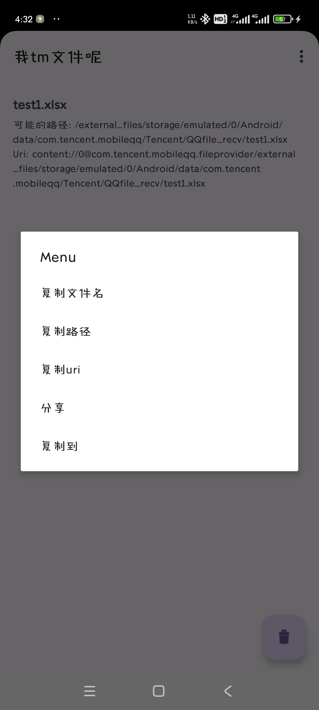
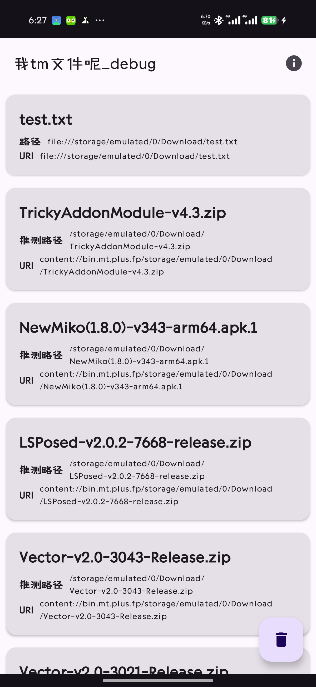

# 我 tm 文件呢

一个用来定位和转移“别人给你的文件到底被 App 藏哪了”的 Android 小工具。

微信、企业微信、QQ 等应用下载或接收文件后，有时文件路径不直观，系统文件管理器也不一定好找。把文件“用本应用打开”或“分享到本应用”，就可以查看文件名、URI、推测路径，并继续复制、分享或用其他应用打开。

## 功能

- 支持从其他应用通过“打开方式”接收文件。
- 支持从其他应用通过“分享”接收单个或多个文件。
- 显示文件名、URI 和推测路径信息。
- 一键复制文件名、路径或 URI。
- 将接收到的文件复制到用户选择的目录。
- 使用系统 SAF 目录授权写入文件，不申请全盘存储权限。
- 支持再次分享文件，或调用其他应用打开文件。
- 清空记录后可通过 Snackbar 撤销。

## 使用方法

1. 在微信、QQ、文件管理器或其他应用里找到目标文件。
2. 选择“打开方式”“用其他应用打开”或“分享”。
3. 在系统选择器里选择“定位文件”。
4. 在列表中点击文件可直接打开，长按可打开操作菜单。

## 复制到其他目录

选择“复制到”后，应用会调用系统目录选择器。选择目标目录后，文件会通过 Android 的 Storage Access Framework 写入该目录。

这意味着：

- 不需要 `MANAGE_EXTERNAL_STORAGE` 全盘文件权限。
- 不需要手动授予传统读写存储权限。
- 目标目录由用户显式选择，行为更符合 Android 11+ 的存储模型。

## 路径说明

Android 的 `content://` URI 并不总能转换为真实文件路径，尤其是来自微信、QQ、云盘、系统下载器或第三方文件提供器时。

因此应用会把 `content://` 文件的路径标记为“推测路径”。真正可靠的文件访问依据是 URI；复制、打开和分享等操作都优先基于 URI 完成。

## 截图




## 构建

项目使用 Gradle Wrapper 构建：

```bash
./gradlew :app:assembleDebug
```

Windows 下：

```powershell
.\gradlew.bat :app:assembleDebug
```

Release 构建：

```bash
./gradlew :app:assembleRelease
```

如果项目根目录存在 `signing.properties`，release 包会使用其中的签名配置；如果不存在，构建不会在配置阶段失败。

## 技术栈

- Kotlin
- AndroidX
- Jetpack Compose
- Material 3
- Storage Access Framework

## 隐私

应用只处理用户主动通过“打开方式”或“分享”传入的文件 URI。复制文件时，目标目录也由用户通过系统目录选择器主动授权。

应用不会扫描设备文件，也不需要全盘存储权限。

## License

见 [MIT LICENSE](./LICENSE)。
